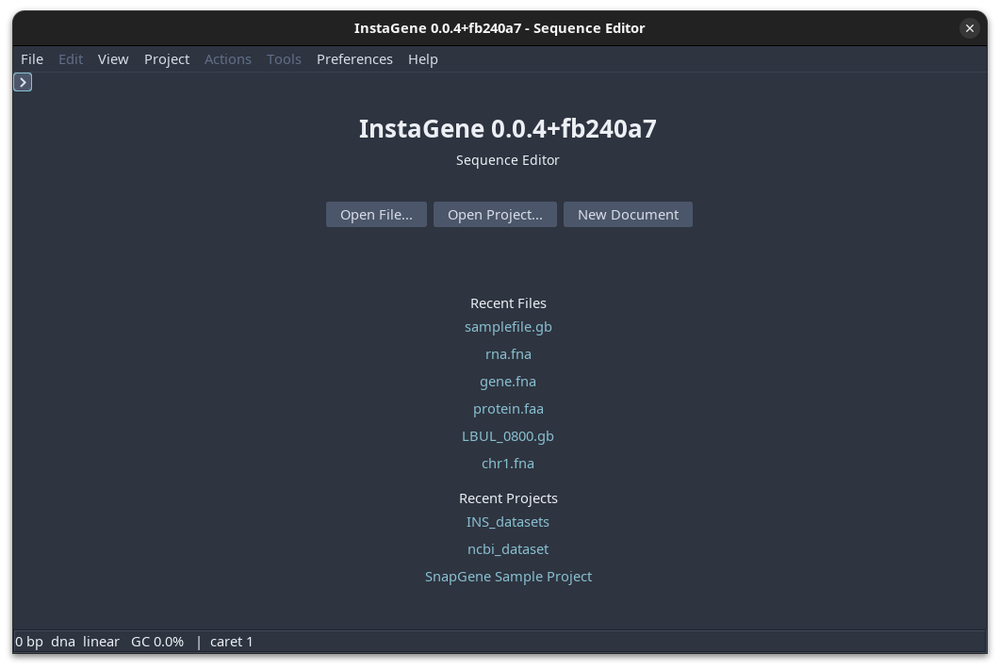

# Getting Started

This page explains how to install InstaGene, launch it, and open your first
sequence. For a tour of the workspaces, see the [GUI Reference](gui.md).

## Choose an installation method

### Windows

Download the `.msi` from a tagged GitHub Release or from the CI artifacts for
the commit you want to try. Run the installer and launch **InstaGene** from the
Start menu or desktop shortcut. The installer includes a Java runtime, so a
separate Java installation is not required.

The installer registers common sequence, annotation, and chromatogram file
types. Use **File → Open** or drag a file from Explorer into the InstaGene
window when a file type is not associated.

### macOS

Download the `.dmg`, open it, and drag `InstaGene.app` to Applications. Launch
it from Finder. Common sequence, annotation, and chromatogram files open in
InstaGene from Finder; **File → Open** and drag-and-drop are also available.
macOS may show its normal warning for an application downloaded from the
internet; use the system’s documented **Open** action if you trust the release
source.

### Linux

For Debian or Ubuntu, install the `.deb`:

~~~bash
sudo apt install ./instagene_0.0.4_amd64.deb
instagene plasmid.gb
~~~

For Fedora/RHEL, use the `.rpm`. The app-image archive is a portable option
when you do not want a system package. Extract it, make the launcher executable
if necessary, and run the included application.

### Portable GUI JAR

The portable JAR works on desktop operating systems with Java 21 or newer:

~~~bash
java -Xmx8g -jar instagene-gui.jar
~~~

The `-Xmx` value is the maximum heap available to the application. Increase it
for very large genomes only when the machine has enough memory.

## Build from source

The repository includes the Gradle wrapper. Java 21 or newer is required for
the build:

~~~bash
git clone https://github.com/novelprotein/instagene.git
cd instagene
./gradlew build
~~~

Run one front end directly:

~~~bash
./gradlew :app-gui:runGui
./gradlew :app-cli:runCli --args="help"
./gradlew :app-web:runWeb --args="--port 8080"
~~~

On Windows, use `gradlew.bat` in place of `./gradlew`.

## Open your first sequence

The welcome screen provides the starting actions for the desktop application.
Open a sequence file, open an existing project, create a new document, or
choose an available recent file or project.

1. Start InstaGene.
2. Choose **Open File...** on the welcome screen, or use **File → Open**.
3. Select a FASTA or GenBank file.
4. Begin on **Info** to check the molecule type, topology, length, and
   composition.
5. Use **Sequence** to inspect or edit bases, **Features** for annotations,
   and **Map** for a circular plasmid view.
6. Save with **File → Save**. For annotated or circular records, GenBank is
   generally the safest export format because FASTA does not retain the full
   feature table.

## Supported files

| Family | Common extensions | Built-in behavior |
|---|---|---|
| FASTA and bare sequence | `.fa`, `.fasta`, `.fna`, `.fas`, `.faa`, `.seq`, `.txt` | Read and write sequence records |
| GenBank / ApE | `.gb`, `.gbk`, `.genbank`, `.ape` | Read and write annotations and topology |
| GFF3 | `.gff`, `.gff3` | Read and write annotations with sequence data |
| EMBL / ENA | `.embl`, `.ena` | Read and write flat-file sequence records |
| Swiss-Prot | `.swiss`, `.sprot`, `.dat` | Read and write protein-style flat-file records |
| FASTA alignment | `.aln`, `.afa`, `.msa` | Read as multi-record FASTA alignment input |
| Chromatograms | `.ab1`, `.abi`, `.scf` | Read sequencing trace calls where supported |
| Notes and documents | `.md`, `.markdown`, `.notes`, `.log`, images, PDF | Edit text in-app or open with the operating system |

For a proprietary or legacy sequence file, configure an external converter if
one is available. A converter must emit FASTA, GenBank, EMBL, or GFF3; it is
not included with the application.

## Build and packaging tasks

| Command | Purpose |
|---|---|
| `./gradlew build` | Build all modules and run checks and tests |
| `./gradlew :app-gui:runGui` | Run the desktop application |
| `./gradlew :app-cli:runCli --args="help"` | Show CLI commands |
| `./gradlew :app-web:runWeb --args="--port 8080"` | Start the local web front end |
| `./gradlew :app-cli:bench` | Run engine benchmarks |
| `./gradlew :app-gui:jpackage -PjpackageType=DEB` | Build a Linux DEB |
| `./gradlew :app-gui:jpackage -PjpackageType=RPM` | Build a Linux RPM |
| `./gradlew :app-gui:jpackage -PjpackageType=MSI` | Build a Windows MSI |
| `./gradlew :app-gui:jpackage -PjpackageType=DMG` | Build a macOS DMG |

Native installers must be built on their target operating system because
`jpackage` does not cross-compile desktop packages.
