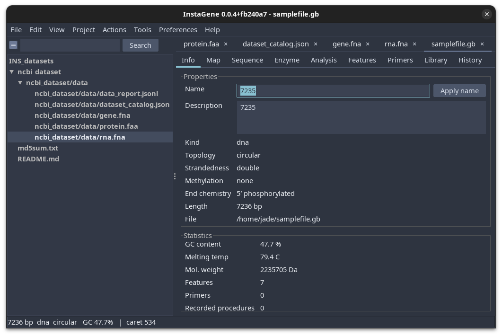
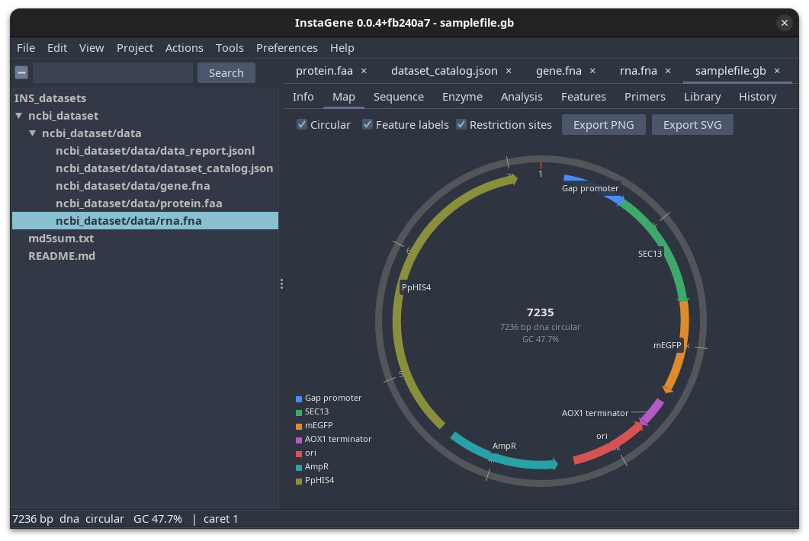
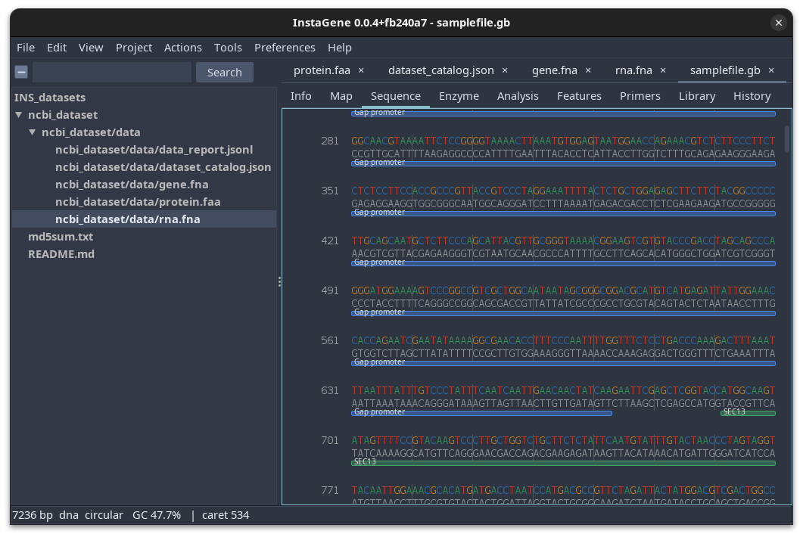
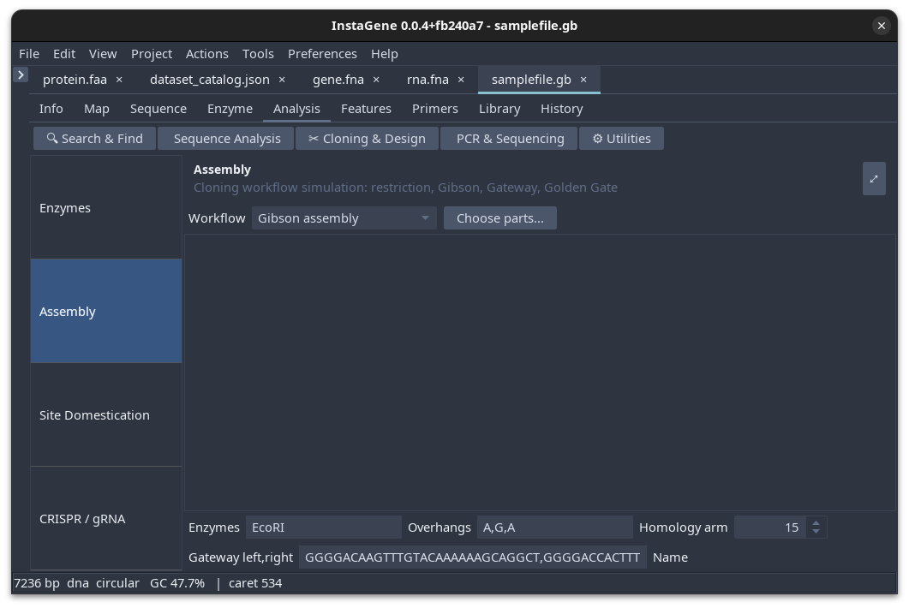
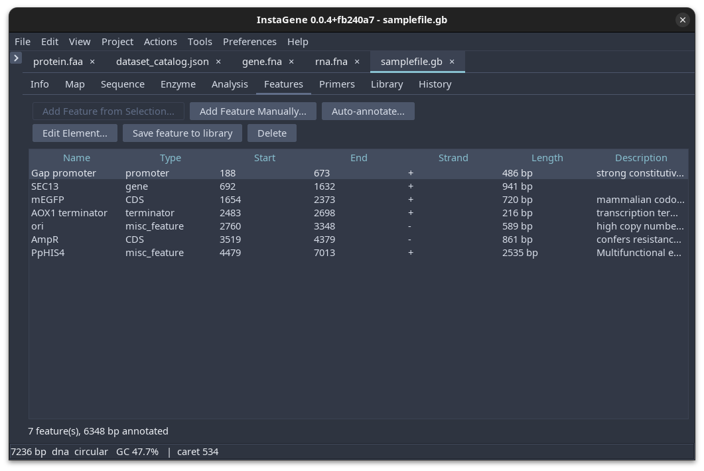
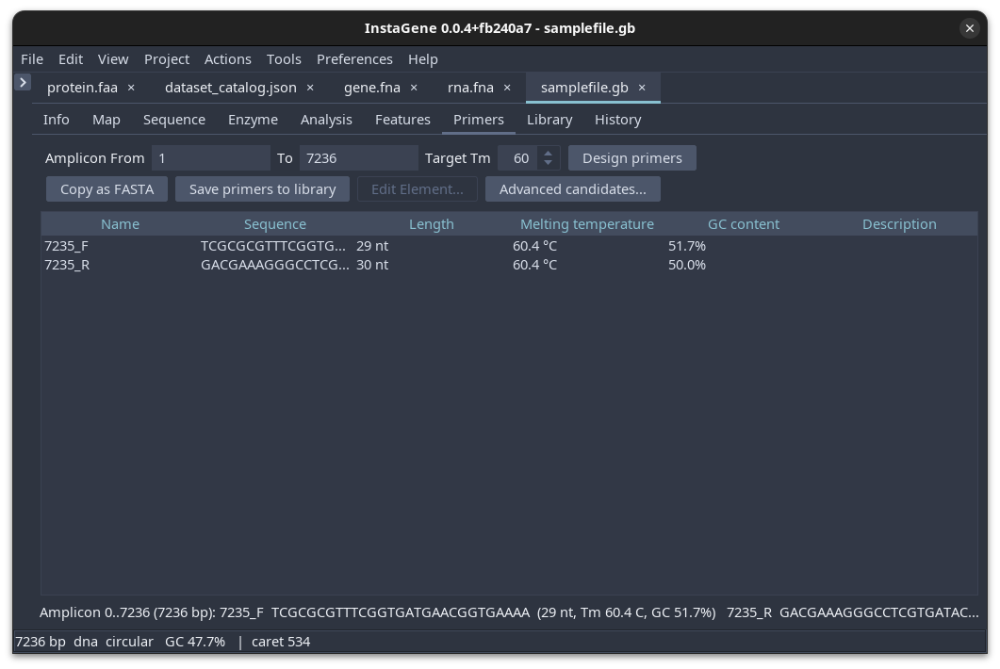
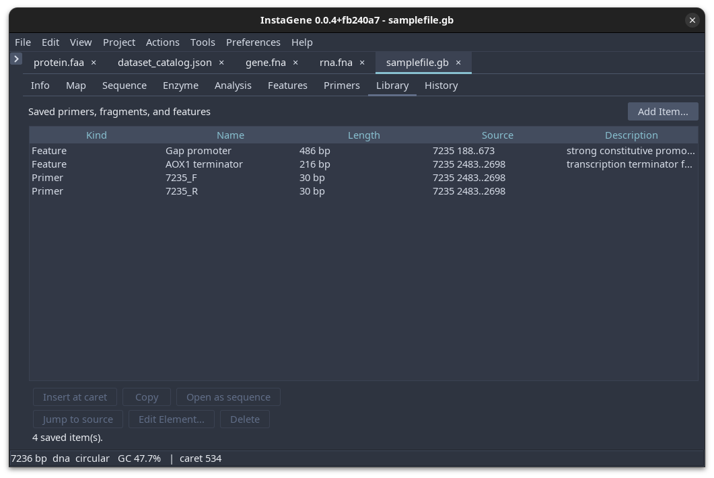
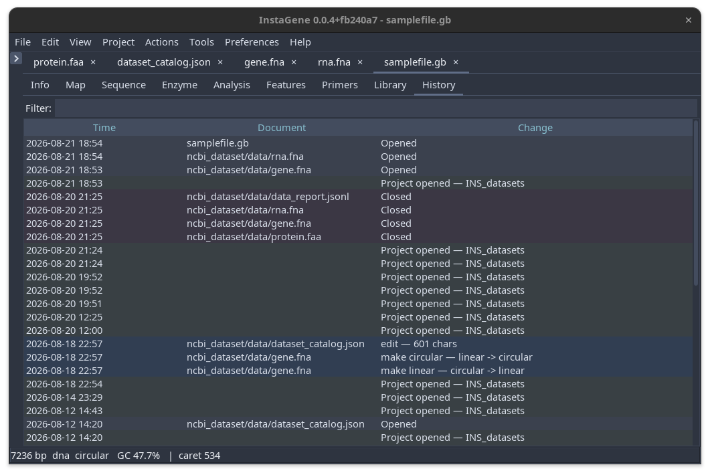

# Desktop GUI guide

The desktop application is InstaGene's main researcher-facing workspace. It
combines document tabs, a project browser, sequence editing, annotation tools,
maps, restriction analysis, primer design, and analysis workflows in one
application.

## Launching

Use a native installer when possible. Native Windows, macOS, and Linux packages
bundle their Java runtime. The portable JAR requires Java 21 or newer.

Most users launch the installed application from the Windows Start menu, macOS
Applications folder, or Linux application menu. You can also launch it from a
terminal:

~~~bash
./gradlew :app-gui:runGui
java -Xmx8g -jar instagene-gui.jar
instagene gui plasmid.gb
~~~

The optional file argument opens when the application starts. You can also
open files later from the welcome screen, the File menu, or drag-and-drop.

## First-use workflow

1. Open a sequence or project from the welcome screen.
2. Confirm the record identity and molecule properties on **Info**.
3. Use **Map** for a circular overview or **Sequence** for base-level work.
4. Review or create annotations in **Features**.
5. Check restriction sites in **Enzyme** before choosing an assembly strategy.
6. Design primers in **Primers**, then save them to **Library** if they should
   be reused.
7. Use **Analysis** for higher-level calculations and workflows.
8. Use **History** to review edits and recorded project operations.

The tool tabs are shared across document tabs. Changing the active document
binds the panels to that document; it does not create a separate tool panel
for every open file.

## Workspace tabs

### Info

The Info tab is the quickest sanity check after opening a file. Review the
name, description, molecule type, topology, methylation, end chemistry, length,
file path, GC content, melting temperature, molecular weight, feature count,
and primer count. Edit the name or description only when you intend to change
the record metadata, then save the document.

### Map

Map displays circular or linear sequence features overlay in sections over the sequence.
For circular plasmids, use the controls to show feature labels, choose whether
all or only visible annotations receive labels, and show restriction sites.
Labels fall back from the feature name to `label`, `gene`, and feature type
qualifiers when a name is not present. Select a feature or map region and the
same region will be selected in the sequence and feature tools. The map can be
exported as PNG or SVG for reports and records.
Use the `−` and `+` controls to zoom from 50% to 600%; the percentage shown
between them is a read-only indicator, and **Reset** returns to 100%. Enlarged
circular and linear maps remain navigable through the scrollbars. Feature
labels reflow with the zoomed map, adjust as the viewport scrolls, and fade at
viewport edges to keep callouts attached and readable without changing sequence
coordinates or export dimensions.

### Sequence

Sequence is the direct nucleic base editor. It displays nucleotide or protein text with
features highlighted and researcher-facing coordinates. Type valid residues to
insert them at the caret or replace the current selection; Backspace/Delete,
clipboard operations, and all resulting annotation shifts are undoable. Feature
segments and primer bindings are clipped or shifted with edits. Use the Edit
menu for reversible changes, keyboard selection, clipboard operations, and zoom
controls. Save before closing if the edit should be retained.

### Enzyme

The Enzyme tab lists the enabled restriction-enzyme catalog and the cut count
for the active sequence. Select an enzyme to inspect individual sites, check
enzymes for a working digest, and review the resulting fragments. The panel
also supports custom enzyme definitions and catalog preferences. Large-sequence
cut counts arrive asynchronously; completed enzyme rows surface as the catalog
scan progresses, with a completed-enzyme counter and **Cancel scan** control,
so the editor remains usable while a scan is running.

### Analysis

Analysis groups workflows by task rather than by file format. Depending on the
selected workflow, you can explore search and find, sequence statistics, graph
profiles, ORFs, alignments, Sanger reads, NCBI/BLAST queries, virtual gels,
assembly, recombination, CRISPR guides, site domestication, and calculators.
Read the inputs and warnings shown by each workflow before treating a result as
an experimental decision.

The Sanger Alignment workflow accepts multiple ABI/AB1 or SCF files, and can
also scan a selected folder recursively. Set the minimum quality threshold,
align the reads, then select a result row to inspect mismatch coordinates,
nearby called bases/quality values, and raw A/C/G/T signal traces when the file
contains them. The report distinguishes substitutions, low-quality calls,
insertions, deletions, and uncovered reference bases. Unreadable files are
summarized without discarding valid reads; export the completed verification as
Markdown or JSON.

The **NCBI / BLAST** workspace makes remote actions explicit. Its **Result
cache** control starts at **Network only** and does not write responses until a
researcher selects a cache mode. The other choices reuse a local,
integrity-checked NCBI cache, prefer a fresh response with an offline fallback,
or work cache-only. When a GenBank record is opened, its Info metadata records
the request, response SHA-256, retrieval time, and whether the result came from
the network or cache. BLAST jobs remain live, remote requests and are not
silently replayed from a response cache.

### Features

Features is the annotation table. It shows name, type, start, end, strand,
length, and description. Add a feature from a selection, create one manually,
edit its qualifiers, display properties, delete it, or save it to the feature
library.

#### Annotating a record

1. Select bases in **Sequence** and choose **Tools → Features → Add Feature
   from Selection**, or use **Add Feature Manually** when coordinates are
   already known.
2. Set a clear name, a suitable feature type, the strand, and notes or
   qualifiers needed by the next tool in the workflow. Coordinates shown in the
   editor are one-based and inclusive.
3. Use **Edit Element** to change color, visibility, display order, translation
   settings, and annotations. Save recurring annotations to the Feature Library
   for reuse.
4. **Auto-annotate** scans using bundled presets and saved definitions. Search
   both strands when appropriate, then review each match before saving. Its
   preview reports definitions completed and can be cancelled; applying a large
   library also continues in the background.

Use GenBank for annotated or circular records. FASTA cannot retain features,
qualifiers, colors, or circular topology. The same short guide is available in
**Help → Feature annotation guide**.

### Primers

Primers designs candidates for a selected or explicitly entered amplicon. Set
the target melting temperature, inspect length, Tm, GC content, and sequence,
then copy the pair as FASTA or save it to the Library. Candidate screening is a
design aid; check primer specificity, synthesis constraints, and the intended
reaction conditions separately.

### Library

Library stores reusable primers, fragments, and features. Select an item to
copy it, edit it, delete it, open it as a sequence, or jump to its source
annotation when a source record is available. The library is user preference-backed,
so keep project-specific records and reusable lab assets organized intentionally.

### History

History records opened and closed documents, project operations, edits, and
important molecule changes. Use it to understand how a record reached its
current state and to support reproducibility. History is an audit aid, not a
replacement for version control or a laboratory notebook.

## Menus and common actions

### File

- **Open** and **Open Project** load sequence files or project folders.
- **Recent Files** and **Recent Projects** reopen previously used locations.
- **Save** and **Save As** write the active record.
- **Close Tab** closes one document after the normal unsaved-change check.
- **Exit** closes the window, persists project state, cleans up workers, and
  asks about unsaved documents before the application exits.

### Edit and View

Edit provides undo, redo, clipboard operations, selection, and sequence edits.
View provides zoom, panel navigation, the file browser, and theme controls.
The platform menu shortcut is Ctrl on Windows/Linux and Command on macOS.

### Project

Projects keep a folder of sequence and supporting files together. The project
browser can open files in tabs, search project content, manage collections, and
run supported batch operations. Project manifests and edit history are stored
inside the project folder; keep them with the project when moving it between
machines. **Reload Project from Disk** refreshes clean externally changed tabs,
preserves dirty buffers as local conflicts, keeps missing-file tabs available,
and can open newly declared supported manifest files. It does not silently
close work or overwrite an unsaved edit.

With a sequence tab active, **Project → ELN / Lab Notebook** copies a Markdown
summary or exports individual sequence, primer CSV, map SVG, and report
attachments. **Export Generic ELN/LIMS Bundle** writes a local vendor-neutral
ZIP containing a versioned integrity manifest, standard sequence attachments,
primer CSV, provenance summary, and a map SVG when the sequence is non-empty.
It never uploads data or contacts a vendor. See the
[researcher handoff guide](tasks.md#hand-off-a-record-to-an-eln-or-lims).

### Tools and Actions

Tools exposes restriction-enzyme management, primer actions, library actions,
analysis workflows, and optional external tools. Actions provides shortcuts to
the analysis workflows most often used from the active sequence.

## Saving and format choice

Use GenBank when the record has annotations, primers, circular topology,
provenance, or molecule properties that should survive a round trip. Use FASTA
for a simple sequence or when a downstream tool specifically requires it. GFF3
is useful for annotation-centric exchange, but it should be checked against the
associated sequence before use.

## Responsiveness and large files

File parsing and large digest/feature-library scans are designed to run away
from the Swing event thread. Some workflows continue in the background and
apply results only when they still match the active document. The practical
workload targets are a 10 kb plasmid opening and rendering within roughly two
seconds on a typical desktop, a 100 kb construct with responsive scrolling,
and multi-megabase files with visible background work and cancellation where a
workflow supports it. Sequence rendering paints only rows in the viewport;
tables use Swing's viewport rendering rather than creating cells for every
record. Loading a very large genome can still require substantial memory and
time, so use a machine with enough RAM and avoid opening multiple copies
unnecessarily.

## Troubleshooting

| Symptom | What to check |
|---|---|
| File does not open as a sequence | Check the extension and first lines; unknown or proprietary formats may need a converter. |
| Features disappear after export | Prefer GenBank; FASTA does not carry the full feature table. |
| A digest table is temporarily empty | Wait for the asynchronous scan, or check that the active document is a nucleotide sequence. |
| A project opens without expected files | Keep the project manifest and files together; inspect the project browser paths. |
| The app does not start | Try the native package, verify the portable JAR uses Java 21+, and check that the OS has a display session. |
